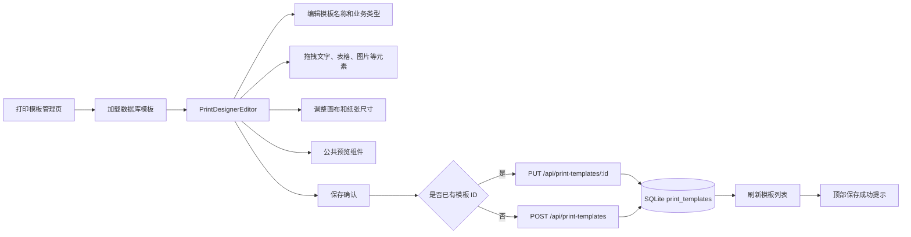
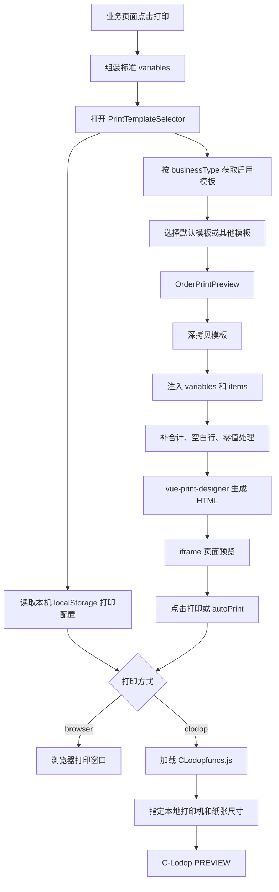

# 打印机项目实现

> 最后更新：2026-09-17
> 当前状态：模板管理、可视化设计、业务变量渲染、公共预览、浏览器打印、C-Lodop 打印机选择与本地配置均已接通。

## 1. 文档用途

本文档记录本项目打印模块的完整实现，不再作为“进度与计划”使用。

后续在其他项目中实现打印功能时，可以直接参考本文档完成：

- 打印模板的数据表与接口。
- 可视化模板设计器的接入与定制。
- 业务数据到模板变量的转换。
- 动态明细表格、合计、空白行和零值处理。
- 统一的前端预览。
- 浏览器打印与 C-Lodop 打印的通道切换。
- 本地打印机、端口和服务地址的保存与检测。
- 常见兼容性问题与验收方法。

## 2. 实现范围

当前已经实现以下功能：

| 模块 | 功能 |
| --- | --- |
| 模板管理 | 新增、设计/编辑、查看设计、复制、设为默认、删除、启用状态展示与筛选 |
| 模板存储 | 模板元数据和设计 JSON 保存到 SQLite |
| 模板设计器 | 基于 `vue-print-designer` 的可视化拖拽设计 |
| 数据库模板列表 | 设计器左侧直接加载服务器中的已有模板 |
| 设计器工具栏 | 自定义绿色保存按钮、下拉菜单、预览、退出 |
| 保存交互 | 保存和退出均有确认框，保存成功显示顶部提示 |
| 页面尺寸 | 设计器尺寸变化后自动同步纸张宽高和纸张类型 |
| 业务类型 | 模板保存时同步保存销售、采购、退货等业务类型 |
| 可用变量 | 订单、客户、联系人、商品明细、合计、金额大写等变量 |
| 动态表格 | `@items` 根据商品数量生成明细行 |
| 表格优化 | 默认追加 1 行空白行、表格零值显示为空、单元格垂直居中 |
| 合计行 | 自动补充件数、数量、金额、含税金额等合计变量 |
| 公共选择弹窗 | 公共模板选择、打印方式选择和打印机设置入口 |
| 公共预览 | 设计器预览和业务单据预览共用同一个组件 |
| 浏览器打印 | 生成隐藏 iframe，调用浏览器打印窗口 |
| C-Lodop | 自动加载 SDK、检测服务、枚举打印机、指定打印机和纸张尺寸 |
| 垂直文字 | 浏览器预览和 C-Lodop 输出分别做兼容处理 |
| 本地配置 | 打印方式、协议、主机、端口、打印机名称保存在浏览器本地 |

当前销售订单入口位于：

```text
src/views/admin/sales/UnifiedOrderList.vue
```

当前完成真实业务数据接入的是销售订单新格式列表。采购、退货、调拨等业务类型已经具备模板存储和设计能力，但仍需要各自实现业务变量适配器及页面入口。

模板管理入口位于：

```text
src/views/admin/system/PrintTemplate.vue
```

## 3. 技术栈与核心文件

### 3.1 技术栈

| 层级 | 技术 |
| --- | --- |
| 前端 | Vue 3、Vite |
| 设计器 | `vue-print-designer` 1.7.33 |
| 后端 | Flask |
| 数据库 | SQLite |
| 本地打印 | C-Lodop |
| 备用打印 | 浏览器原生打印 |

### 3.2 核心文件

| 文件 | 职责 |
| --- | --- |
| `src/views/admin/system/PrintTemplate.vue` | 模板列表和模板管理 |
| `src/components/print/PrintDesignerEditor.vue` | 可视化模板设计器封装 |
| `src/components/print/PrintTemplateSelector.vue` | 公共模板和打印方式选择弹窗 |
| `src/components/print/PrintClientSettingsDialog.vue` | 本地打印方式、服务地址和打印机设置 |
| `src/components/print/OrderPrintPreview.vue` | 变量渲染、前端预览和打印入口 |
| `src/utils/lodopPrint.js` | C-Lodop 检测、打印机读取和打印调用 |
| `src/utils/printClientConfig.js` | 本地打印配置默认值、校验和持久化 |
| `src/utils/chineseMoney.js` | 数字金额转中文大写 |
| `src/api/printTemplate.js` | 打印模板前端 API |
| `backend/routes/print_templates.py` | 打印模板后端接口 |
| `backend/utils/db.py` | SQLite 连接、数据表初始化和默认模板 |
| `src/views/admin/sales/UnifiedOrderList.vue` | 销售订单打印数据适配和组件接入 |

## 4. 总体架构

打印模块分成四层：

1. 模板层：保存纸张、业务类型和设计器 JSON。
2. 业务适配层：把订单、采购单等业务对象转换成统一打印变量。
3. 渲染层：使用设计器引擎将模板和变量生成 HTML。
4. 输出层：将同一份 HTML 交给浏览器或 C-Lodop。

### 4.1 模板设计和保存流程



### 4.2 业务预览和打印流程



## 5. 数据存储边界

模板数据和本地打印设置使用不同的存储位置。

### 5.1 服务器数据

以下数据保存在 SQLite：

- 模板名称。
- 业务类型。
- 纸张类型。
- 纸张宽高。
- 是否默认。
- 是否启用。
- 设计器生成的完整 JSON。

开发环境数据库：

```text
data/order_system.db
```

Docker 容器内数据库：

```text
/app/data/order_system.db
```

### 5.2 客户端本地数据

以下数据只保存在当前浏览器的 `localStorage`，不会上传数据库：

- 使用浏览器打印还是 C-Lodop。
- C-Lodop 协议。
- C-Lodop 主机地址。
- C-Lodop 端口。
- 当前电脑选择的打印机名称。

存储键：

```text
order-system-print-client-config
```

兼容旧打印机名称存储键：

```text
order-system-selected-printer
```

这样设计的原因是每台客户端电脑安装的打印机、驱动、端口和 C-Lodop 地址可能不同，不能把某台电脑的配置保存为全系统公共配置。

## 6. 数据库模型

打印模板表由 `backend/utils/db.py` 自动初始化：

```sql
CREATE TABLE print_templates (
    id INTEGER PRIMARY KEY AUTOINCREMENT,
    name TEXT NOT NULL,
    business_type TEXT NOT NULL,
    paper_type TEXT,
    page_width INTEGER NOT NULL,
    page_height INTEGER NOT NULL,
    is_default INTEGER DEFAULT 0,
    enabled INTEGER DEFAULT 1,
    content TEXT,
    created_at TEXT DEFAULT CURRENT_TIMESTAMP,
    updated_at TEXT
);
```

索引：

```sql
CREATE INDEX idx_print_templates_business_type
ON print_templates(business_type);

CREATE INDEX idx_print_templates_is_default
ON print_templates(is_default);
```

首次创建数据表时会插入销售、采购和退货的基础模板记录。基础记录可能还没有 `content`，必须进入设计器保存设计后，才会出现在业务打印选择列表中。

当前初始化 SQL 中三条基础记录的 `paper_type` 为“二等分”，宽高却是 `210 × 140mm`；设计器预设中的“二等分”为 `241 × 140mm`。这是历史默认值不一致，新项目迁移时应统一名称和实际尺寸，现有项目则以模板最终保存的 `pageWidth`、`pageHeight` 为准。

## 7. 模板数据模型

### 7.1 模板记录

前端统一使用驼峰字段：

```json
{
  "id": 1,
  "name": "销售出库单",
  "businessType": "sale",
  "paperType": "三联单",
  "pageWidth": 210,
  "pageHeight": 140,
  "isDefault": true,
  "enabled": true,
  "content": {},
  "createdAt": "2026-09-17 10:00:00",
  "updatedAt": "2026-09-17 10:30:00"
}
```

字段说明：

| 字段 | 类型 | 说明 |
| --- | --- | --- |
| `id` | number | 数据库主键 |
| `name` | string | 模板名称 |
| `businessType` | string | 业务类型 |
| `paperType` | string | 三联单、二等分、A4、自定义等 |
| `pageWidth` | number | 纸张宽度，单位 mm |
| `pageHeight` | number | 纸张高度，单位 mm |
| `isDefault` | boolean | 同一业务类型的默认模板 |
| `enabled` | boolean | 是否允许业务页面使用 |
| `content` | object | 设计器完整 JSON |

设计器支持的业务类型：

| 值 | 名称 |
| --- | --- |
| `sale` | 销售 |
| `purchase` | 采购 |
| `return` | 退货 |
| `transfer` | 调拨 |
| `inventory` | 盘点 |
| `receipt` | 收款 |
| `payment` | 付款 |

后端目前没有对 `businessType` 做固定枚举校验。迁移到其他项目时，应由前后端共享枚举，避免拼写不一致。

### 7.2 `content` 结构

典型结构：

```json
{
  "canvasSize": {
    "width": 794,
    "height": 529
  },
  "pages": [
    {
      "id": "sale-page",
      "elements": []
    }
  ],
  "unit": "mm",
  "testData": {},
  "ext": {
    "availableVariables": []
  }
}
```

注意：

- `canvasSize` 是设计器内部像素尺寸。
- 顶层 `pageWidth`、`pageHeight` 是实际打印毫米尺寸。
- 像素转毫米按 96 DPI 计算：`mm = px * 25.4 / 96`。
- `pages[].elements` 的详细结构由 `vue-print-designer` 管理。
- 业务代码不要手工拼接或随意重写元素 JSON，只在保存和预览前执行必要的兼容修正。

已识别的纸张尺寸：

| 纸张 | 宽度 mm | 高度 mm |
| --- | ---: | ---: |
| 三联单 | 210 | 140 |
| 二等分 | 241 | 140 |
| A4 | 210 | 297 |
| A3 | 297 | 420 |
| A5 | 148 | 210 |

设计器中修改画布尺寸后，顶部尺寸、纸张类型以及上传服务器的数据会同步更新。横向 A4、A3、A5 也会按旋转后的宽高保存。

## 8. 打印模板接口

前端 API 文件使用 `/print-templates`，请求封装会加上 `/api` 前缀。下面列出实际 HTTP 地址。

### 8.1 通用响应

成功：

```json
{
  "success": true,
  "data": {},
  "message": "操作成功"
}
```

失败：

```json
{
  "success": false,
  "message": "错误原因"
}
```

### 8.2 接口列表

| 方法 | 地址 | 用途 |
| --- | --- | --- |
| `GET` | `/api/print-templates` | 获取模板列表 |
| `GET` | `/api/print-templates/:id` | 获取单个模板 |
| `POST` | `/api/print-templates` | 新建模板 |
| `PUT` | `/api/print-templates/:id` | 更新模板 |
| `DELETE` | `/api/print-templates/:id` | 删除模板 |
| `POST` | `/api/print-templates/:id/set-default` | 设为默认模板 |
| `POST` | `/api/print-templates/migrate` | 从旧 localStorage 批量迁移模板 |

### 8.3 获取模板列表

```http
GET /api/print-templates?businessType=sale&enabledOnly=true
```

查询参数：

| 参数 | 类型 | 默认值 | 说明 |
| --- | --- | --- | --- |
| `businessType` | string | 空 | 按业务类型过滤 |
| `enabledOnly` | boolean string | `false` | 是否只返回启用模板 |

排序规则：

1. 默认模板在前。
2. 同级按创建时间倒序。

### 8.4 获取单个模板

```http
GET /api/print-templates/1
```

不存在时返回 HTTP `404`。

### 8.5 新建模板

```http
POST /api/print-templates
Content-Type: application/json
```

```json
{
  "name": "销售出库单",
  "businessType": "sale",
  "paperType": "三联单",
  "pageWidth": 210,
  "pageHeight": 140,
  "isDefault": false,
  "enabled": true,
  "content": {}
}
```

必填字段：

- `name`
- `businessType`
- `pageWidth`
- `pageHeight`

创建成功后返回：

```json
{
  "success": true,
  "message": "创建成功",
  "data": {
    "id": 1
  }
}
```

### 8.6 更新模板

```http
PUT /api/print-templates/1
Content-Type: application/json
```

支持部分更新：

```json
{
  "name": "销售出库单新版",
  "businessType": "sale",
  "paperType": "A4",
  "pageWidth": 210,
  "pageHeight": 297,
  "enabled": true,
  "content": {}
}
```

当 `isDefault` 为 `true` 时，后端会先取消同业务类型下其他模板的默认状态。

### 8.7 删除模板

```http
DELETE /api/print-templates/1
```

默认模板不允许直接删除。必须先将同业务类型的其他模板设为默认，再删除原模板。

### 8.8 设置默认模板

```http
POST /api/print-templates/1/set-default
```

同一业务类型只保留一个默认模板。

### 8.9 迁移旧模板

```http
POST /api/print-templates/migrate
Content-Type: application/json
```

```json
{
  "templates": [
    {
      "name": "旧销售模板",
      "businessType": "sale",
      "pageWidth": 210,
      "pageHeight": 140,
      "content": {}
    }
  ]
}
```

后端以“模板名称 + 业务类型”判断重复。模板管理页仅在数据库模板列表为空时尝试执行旧数据迁移。

### 8.10 前后端字段转换

SQLite 和后端返回下划线字段，例如：

```text
business_type
page_width
is_default
```

`src/api/printTemplate.js` 会统一转换成：

```text
businessType
pageWidth
isDefault
```

其他业务组件应始终使用转换后的驼峰字段，不要直接依赖数据库字段名。

## 9. 设计器实现

### 9.1 公共封装

`PrintDesignerEditor.vue` 对第三方设计器做了以下封装：

- 接收当前模板和数据库模板列表。
- 将数据库模板转换为设计器模板列表。
- 设置中文语言和项目标题。
- 注入测试数据和可用变量。
- 隐藏第三方原生的新建、保存等入口。
- 使用项目自己的绿色保存按钮。
- 保存按钮使用分体下拉样式。
- 下拉菜单保留操作栏排序、帮助、设置。
- 设计器内部弹窗通过层级修正显示在最上方。
- 顶部提供模板名称和业务类型。
- 监听画布尺寸并同步毫米尺寸。
- 保存和退出前弹出确认框。
- 设计器预览复用 `OrderPrintPreview.vue`。

组件输入：

```js
{
  visible: Boolean,
  template: Object,
  templates: Array
}
```

组件事件：

```text
save
close
```

保存事件的数据就是可以直接传给创建或更新接口的模板对象。

### 9.2 模板列表

设计器左侧模板列表来自数据库，而不是设计器内置的临时模板。

加载时会：

1. 把 `template.content` 转换为设计器的 `data`。
2. 追加 `availableVariables`。
3. 选择当前正在编辑的模板。
4. 禁止使用设计器内置复制和删除，统一由项目模板管理页控制。

### 9.3 保存逻辑

保存前执行：

1. 获取设计器实时 JSON。
2. 修正表格明细绑定。
3. 补全表脚合计行。
4. 合并测试数据和可用变量。
5. 同步模板名称、业务类型、纸张类型和纸张尺寸。
6. 根据是否存在 `id` 调用创建或更新接口。

模板管理页保存成功后会：

- 重新加载模板列表。
- 关闭设计器。
- 派发 `order-system-print-templates-updated` 事件。
- 在页面顶部显示保存成功提示。

### 9.4 复制模板

模板管理页的复制按钮会：

- 深拷贝 `content`。
- 保留业务类型、纸张和启用状态。
- 强制 `isDefault = false`。
- 名称改为 `${原模板名称}复制版`。
- 调用新建模板接口生成独立记录。

复制后的模板和原模板没有共享引用，继续编辑不会修改原模板。

## 10. 模板变量契约

业务数据必须先转换为统一的 `variables`，再交给预览组件。模板不应直接读取业务接口的原始下划线字段。

### 10.1 顶层变量

| 变量 | 含义 |
| --- | --- |
| `@storeId` | 门店 ID |
| `@storeName` | 门店名称 |
| `@customerId` | 客户 ID |
| `@customerName` | 客户名称 |
| `@warehouseId` | 仓库 ID |
| `@warehouseName` | 仓库名称 |
| `@orderDate` | 单据日期 |
| `@orderNumber` | 单据编号 |
| `@orderNo` | 单据编号兼容别名 |
| `@contactPerson` | 联系人 |
| `@contactPhone` | 联系电话 |
| `@contactAddress` | 联系地址 |
| `@projectName` | 工程项目 |
| `@logisticsService` | 物流服务 |
| `@goodsPackaging` | 包装方式 |
| `@packaging` | 包装方式兼容别名 |
| `@salesPerson` | 业务员 |
| `@creator` | 制单人 |
| `@orderRemark` | 单据备注 |
| `@taxEnabled` | 是否含税 |
| `@taxRate` | 默认税率 |
| `@totalPackages` | 合计件数 |
| `@totalQuantity` | 合计数量 |
| `@totalAmount` | 未税或小计金额 |
| `@totalTaxAmount` | 含税或单据总金额 |
| `@discountAmount` | 折扣金额 |
| `@otherFees` | 其他费用 |
| `@settlementAccount` | 结算账户 |
| `@customerReceivable` | 客户欠款 |
| `@shouldReceive` | 本单应收 |
| `@amountInWords` | 金额中文大写 |
| `@currentPayment` | 本次收款 |
| `@currentDebt` | 本单欠款 |
| `@items` | 商品明细数组 |

金额中文大写不是设计器临时计算的。业务适配层先执行：

```js
amountInWords: toChineseMoney(shouldReceive)
```

再将结果作为普通变量传入模板。其他项目也应采用这种方式，避免把财务计算规则放进设计器。

### 10.2 商品明细变量

`items` 中每一项支持：

| 字段 | 含义 |
| --- | --- |
| `index` | 序号 |
| `productId` | 商品 ID |
| `goodsName` | 商品名称 |
| `spec` | 规格型号 |
| `unit` | 单位 |
| `warehouseId` | 仓库 ID |
| `warehouseName` | 仓库名称 |
| `currentStock` | 当前库存 |
| `baseUnitId` | 基础单位 ID |
| `conversionRate` | 单位换算比例 |
| `unitConversions` | 单位换算数据 |
| `packages` | 件数或包装数 |
| `quantity` | 数量 |
| `price` | 单价 |
| `taxRate` | 税率 |
| `taxIncludedPrice` | 含税单价 |
| `amount` | 金额 |
| `totalAmount` | 含税金额 |
| `remark` | 商品备注 |

当前销售订单适配器已经填充常用商品字段，但 `currentStock`、`baseUnitId`、`conversionRate`、`unitConversions` 需要业务接口本身提供后才能显示。新项目不要只在设计器里增加变量，还必须在业务适配器中提供同名数据。

### 10.3 销售订单数据适配

销售订单在 `UnifiedOrderList.vue` 中通过 `getOrderPrintVariables(order)` 转换。

核心规则：

- `order.order_goods` 转换为 `items`。
- `order_number` 转为 `orderNumber` 和 `orderNo`。
- 联系人、电话、地址通过现有业务辅助函数获取。
- `totalPackages`、`totalQuantity`、`totalAmount` 通过订单统计函数计算。
- `shouldReceive` 优先取 `order.should_receive`，否则取订单总金额。
- `amountInWords` 根据 `shouldReceive` 计算。
- `currentPayment` 包含本次付款和余额抵扣。
- `currentDebt` 缺失时按“应收 - 本次付款 - 余额抵扣”计算。
- 第一条商品字段会展开到顶层，用于兼容早期模板。

建议在新业务中单独建立适配文件，例如：

```text
src/utils/printAdapters/saleOrder.js
src/utils/printAdapters/purchaseOrder.js
```

这样模板渲染组件只处理统一变量，不了解业务接口结构。

## 11. 变量渲染规则

### 11.1 普通文字

设计器文字内容中使用：

```text
客户名称：@customerName
单据编号：@orderNumber
大写金额：@amountInWords
```

运行时变量会覆盖模板里的 `testData`。`testData` 只用于设计器演示，不能作为真实打印数据。

### 11.2 商品表格

表格的数据变量必须设置为：

```text
@items
```

正确位置是表格的行数据变量 `variable`。

不要把 `@items` 设置到：

```text
columnsVariable
footerDataVariable
```

这两个属性分别表示列定义数据和表脚数据。把 `@items` 放进去会导致商品对象覆盖列定义，最终出现空白表格或错误表头。保存和预览阶段会自动清理这种错误配置。

### 11.3 表格列绑定

推荐给每个需要动态显示的单元格明确设置变量：

```text
@index
@goodsName
@spec
@unit
@quantity
@packages
@price
@amount
@remark
```

渲染规则：

1. 只要表格中存在明确的 `@字段` 绑定，就以明确绑定为准。
2. 没有绑定变量的列保留设计值，通常为空白。
3. 因此模板中没有绑定 `@price` 或 `@amount` 时，不会因为列标题叫“单价”或“金额”而自动渲染数据。
4. 只有旧模板完全没有明确绑定时，才会按列字段名或中文表头做兼容推断。

这个规则用于解决“模板中单价和金额为空，但预览仍自动显示”的问题。

### 11.4 明细行数量

默认：

```text
实际渲染行数 = items.length + 1
```

追加的最后一行为空白行，用于将商品数据和合计区域视觉分隔。

由 `OrderPrintPreview` 的属性控制：

```vue
<OrderPrintPreview :trailing-blank-rows="1" />
```

传 `0` 可以关闭，传更大的整数可以增加更多空白行。该处理只发生在预览运行时，不会修改订单原始数据，也不会把空商品保存回数据库。

### 11.5 表格零值

默认 `hideZeroValues = true`。

表格明细中的以下值会显示为空白：

```text
0
0.0
0.00
+0
-0.00
```

关闭方式：

```vue
<OrderPrintPreview :hide-zero-values="false" />
```

当前零值处理针对表格明细行。顶层合计字段如果也需要隐藏零值，应在业务适配器中转为空字符串，或者后续增加统一格式化规则。

### 11.6 表脚合计

当表格开启表脚但没有表脚数据时，保存和预览阶段会自动生成一行：

- 第一列显示“合计”。
- 件数列使用 `@totalPackages`。
- 数量列使用 `@totalQuantity`。
- 金额列使用 `@totalAmount`。
- 含税金额列使用 `@totalTaxAmount`。

识别时优先使用列字段名，同时兼容常见中文表头。

## 12. 公共预览组件

组件：

```text
src/components/print/OrderPrintPreview.vue
```

### 12.1 Props

| 属性 | 类型 | 默认值 | 说明 |
| --- | --- | --- | --- |
| `visible` | boolean | `false` | 是否显示 |
| `template` | object | `null` | 模板记录 |
| `variables` | object | `{}` | 运行时业务变量 |
| `printer` | object | `null` | 选择弹窗传入的打印机兼容对象 |
| `previewLabel` | string | 当前订单数据预览 | 顶部说明 |
| `autoPrint` | boolean | `false` | HTML 生成后是否立即进入打印流程 |
| `trailingBlankRows` | number | `1` | 明细末尾追加空白行数量 |
| `hideZeroValues` | boolean | `true` | 表格零值是否显示为空 |

事件：

```text
close
```

### 12.2 渲染过程

预览组件不会直接修改数据库模板，而是：

1. 深拷贝 `template.content`。
2. 深拷贝业务 `variables`。
3. 修正表格绑定和表脚。
4. 生成预览专用动态变量，例如 `@__previewItems_0_0`。
5. 处理空白行和零值。
6. 将变量同时写入设计器测试数据、模板变量和运行变量。
7. 调用 `designer.getPreviewHtml()`。
8. 对 HTML 做表格居中和垂直文字标记。
9. 将 HTML 放入 iframe 预览。
10. 打印时复用已经生成的 `renderedHtml`。

因此，业务预览和实际打印使用的是同一份模板、同一份变量和同一份渲染 HTML。

浏览器打印通常与页面预览最接近。C-Lodop 会对垂直文字做额外兼容转换，实际纸张还可能受到打印机驱动边距、缩放、纸张定义和硬件精度影响，不能承诺所有打印机达到像素级完全一致。

### 12.3 表格居中

生成 HTML 后会强制：

```css
table th,
table td {
  vertical-align: middle !important;
  line-height: normal !important;
}
```

C-Lodop 打印文档中还会补充单元格对齐属性，避免只在浏览器预览居中、实际打印不居中的问题。

### 12.4 垂直文字

浏览器预览使用设计器生成的 `writing-mode`。

C-Lodop 对部分 `writing-mode` 和竖排标点支持不一致，因此打印前会：

1. 找出模板中设置为竖排的文字元素。
2. 给对应 HTML 节点添加识别标记。
3. C-Lodop 输出前将文字按字符拆成纵向块。
4. 将括号、顿号、逗号、句号等替换为适合竖排的 Unicode 标点。
5. 保留文字的上、中、下垂直对齐方式。

新增竖排符号时，应扩展 `lodopPrint.js` 中的竖排标点映射，不要在业务组件中单独替换字符串。

## 13. 模板和打印机选择组件

组件：

```text
src/components/print/PrintTemplateSelector.vue
```

### 13.1 Props

| 属性 | 类型 | 说明 |
| --- | --- | --- |
| `visible` | boolean | 是否显示弹窗 |
| `businessType` | string | 必填，按业务类型加载模板 |
| `title` | string | 弹窗标题 |
| `documentNumber` | string/number | 单据编号 |
| `description` | string | 顶部说明 |
| `emptyText` | string | 无模板提示 |
| `footerHint` | string | 底部提示 |
| `printEnabled` | boolean | 是否允许打印按钮 |

事件：

```text
close
preview(template, printer)
print(template, printer)
```

### 13.2 模板选择规则

打开弹窗后请求：

```js
getTemplates({
  businessType: props.businessType,
  enabledOnly: true
})
```

前端还会过滤：

- 必须是启用状态。
- 必须属于当前业务类型。
- 必须已经有 `content`。

默认选中顺序：

1. 当前业务类型的默认模板。
2. 列表中的第一个模板。

### 13.3 按钮可用状态

浏览器打印：

```text
选择模板后，预览和打印按钮可用。
```

C-Lodop：

```text
选择模板，并且本地配置中已有打印机名称后，预览和打印按钮可用。
```

`printEnabled=false` 时只禁用打印按钮，仍可根据配置决定是否允许预览。

## 14. 本地打印配置

### 14.1 配置结构

```json
{
  "version": 1,
  "mode": "clodop",
  "protocol": "http",
  "host": "localhost",
  "port": 8000,
  "printerName": ""
}
```

字段说明：

| 字段 | 说明 |
| --- | --- |
| `mode` | `browser` 或 `clodop` |
| `protocol` | `http` 或 `https` |
| `host` | C-Lodop 服务地址 |
| `port` | 1 到 65535 |
| `printerName` | C-Lodop 返回的本地打印机名称 |

### 14.2 首次部署默认值

第一次打开系统、浏览器还没有本地配置时，会自动生成默认配置：

- 默认打印方式：`clodop`。
- 默认主机：`localhost`。
- HTTP 页面默认端口：`8000`。
- HTTPS 页面默认端口：`8443`。
- 默认打印机名称：空。

也就是说，首次部署会有默认协议、主机和端口，不会因为没有 localStorage 而得到空地址。但打印机名称必须在当前电脑检测和选择后才能确定。

可以通过环境变量覆盖服务地址：

```env
VITE_CLODOP_URL=http://localhost:8000
```

### 14.3 设置弹窗

`PrintClientSettingsDialog.vue` 支持：

- 浏览器打印和 C-Lodop 模式切换。
- 协议、主机、端口设置。
- 自动检测 C-Lodop。
- 加载本地打印机列表。
- 选择默认或指定打印机。
- 保存到当前浏览器。

选择 HTTPS 时，如果当前端口是 `8000`，会自动切换到 `8443`。切回 HTTP 时会将 `8443` 切回 `8000`。

### 14.4 自动检测

自动检测会按顺序尝试当前配置以及以下常见地址：

```text
http://{host}:8000/CLodopfuncs.js?name=CLODOP
http://{host}:18000/CLodopfuncs.js?name=CLODOP
https://{host}:8443/CLodopfuncs.js?name=CLODOP
```

候选主机包括：

```text
当前配置的 host
localhost
127.0.0.1
```

检测成功后会：

1. 回填实际协议、主机和端口。
2. 读取本地打印机列表。
3. 优先保留之前选择的打印机。
4. 否则选择系统默认打印机。
5. 再否则选择第一台打印机。
6. 自动保存本地配置。

### 14.5 每次打印重新读取配置

预览弹窗打开时会读取一次本地配置，实际点击打印时会再次读取：

```js
const config = getPrintClientConfig()
```

这样即使用户在其他入口修改了打印方式或打印机，下一次打印也会使用最新配置。

## 15. 打印输出实现

### 15.1 浏览器打印

流程：

1. 使用已经渲染的 HTML。
2. 生成包含 `@page` 尺寸的完整文档。
3. 创建隐藏 iframe。
4. 等待字体加载。
5. 调用 `iframe.contentWindow.print()`。
6. 打印结束或超时后移除 iframe。

浏览器模式不能通过网页代码强制选择某台物理打印机，最终打印机由浏览器或操作系统打印窗口决定。

### 15.2 C-Lodop

SDK 地址：

```text
{protocol}://{host}:{port}/CLodopfuncs.js?name=CLODOP
```

打印流程：

```js
LODOP.PRINT_INIT(taskName)
LODOP.SET_PRINTER_INDEX(printerName)
LODOP.SET_PRINT_PAGESIZE(0, pageWidth * 10, pageHeight * 10, '')
LODOP.ADD_PRINT_HTM(0, 0, '100%', '100%', html)
LODOP.PREVIEW()
```

说明：

- `SET_PRINT_PAGESIZE` 的宽高单位是 0.1mm，所以毫米值需要乘以 10。
- 当前“打印”按钮进入 C-Lodop 的 `PREVIEW()`，用户可以在 C-Lodop 窗口确认后正式打印。
- 当前没有调用静默打印 `PRINT()`。
- 如果后续实现直接打印，必须增加明确的权限、失败反馈和防重复提交机制。

### 15.3 打印机枚举

C-Lodop 打印机列表包含：

```js
{
  index,
  name,
  driverName,
  portName,
  paperName,
  isDefault
}
```

最终调用时以打印机名称执行 `SET_PRINTER_INDEX`。如果该打印机已被系统重命名或删除，会提示用户重新检测和选择。

## 16. 业务页面接入方式

### 16.1 推荐组件结构

```vue
<PrintTemplateSelector
  :visible="printTemplateDialogOpen"
  business-type="sale"
  title="打印订单"
  :document-number="printTargetOrder?.order_number || ''"
  @close="closePrintTemplateDialog"
  @preview="previewSelectedPrintTemplate"
  @print="printSelectedPrintTemplate"
/>

<OrderPrintPreview
  :visible="printPreviewVisible"
  :template="selectedPrintTemplate"
  :variables="printOrderVariables"
  :printer="selectedPrintPrinter"
  :auto-print="printPreviewAutoPrint"
  @close="closePrintPreview"
/>
```

### 16.2 页面状态

```js
const printTemplateDialogOpen = ref(false)
const printPreviewVisible = ref(false)
const selectedPrintTemplate = ref(null)
const selectedPrintPrinter = ref(null)
const printPreviewAutoPrint = ref(false)
const printTargetOrder = ref(null)
```

### 16.3 预览和打印联动

```js
const openSelectedPrintTemplate = (template, printer, autoPrint) => {
  selectedPrintTemplate.value = template
  selectedPrintPrinter.value = printer
  printPreviewAutoPrint.value = autoPrint
  printTemplateDialogOpen.value = false
  printPreviewVisible.value = true
}

const previewSelectedPrintTemplate = (template, printer) => {
  openSelectedPrintTemplate(template, printer, false)
}

const printSelectedPrintTemplate = (template, printer) => {
  openSelectedPrintTemplate(template, printer, true)
}
```

预览和打印走同一条渲染链路，差别只在 `autoPrint`：

- `false`：先显示项目预览弹窗。
- `true`：HTML 生成后立即调用当前本地打印方式。

### 16.4 接入新业务的步骤

1. 确定业务类型，例如 `purchase`。
2. 创建该业务的打印变量适配器。
3. 保证变量名与设计器可用变量一致。
4. 在业务页面接入 `PrintTemplateSelector`。
5. 在页面接入 `OrderPrintPreview`。
6. 把选择弹窗返回的模板和打印机传给预览组件。
7. 使用真实单据验证多行、空行、零值、合计和分页。
8. 分别验证浏览器打印和 C-Lodop。

不要在每个业务页面重新实现模板弹窗、打印机检测或 HTML 渲染。

## 17. 其他项目迁移清单

迁移到新项目时至少需要以下内容：

### 17.1 前端

```text
src/components/print/PrintDesignerEditor.vue
src/components/print/PrintTemplateSelector.vue
src/components/print/PrintClientSettingsDialog.vue
src/components/print/OrderPrintPreview.vue
src/utils/lodopPrint.js
src/utils/printClientConfig.js
src/utils/chineseMoney.js
src/api/printTemplate.js
```

安装：

```bash
npm install vue-print-designer@1.7.33
```

### 17.2 后端

迁移：

```text
backend/routes/print_templates.py
backend/utils/db.py 中的 print_templates 建表逻辑
```

并在 Flask 应用中注册 `print_templates_bp`。

### 17.3 必须按新项目调整

- API 请求封装和 `/api` 基础地址。
- 数据库连接方式。
- 登录和权限校验。
- 业务类型枚举。
- 订单、采购、退货等数据适配器。
- 系统提示和确认框组件。
- C-Lodop 环境变量。
- 打印模板管理菜单和路由。

## 18. 已做的重要兼容改动

相较于最初的打印模板功能，当前实现增加或修正了：

1. 模板由浏览器临时存储迁移到 SQLite。
2. 设计器模板列表加载数据库真实模板。
3. 设计器只保留项目绿色保存按钮，并增加分体下拉菜单。
4. 设计器预览改为公共 `OrderPrintPreview`。
5. 保存和退出增加确认框。
6. 保存成功增加顶部提示。
7. 纸张尺寸变化同步到模板元数据和服务器。
8. 增加业务类型选择并随模板保存。
9. 模板管理增加复制功能。
10. 销售订单接入公共模板选择弹窗。
11. 模板选择弹窗同时选择打印方式和本地打印机。
12. 打印机配置保存到每台电脑的本地存储。
13. 增加 C-Lodop 自动检测和打印机枚举。
14. 浏览器打印与 C-Lodop 使用统一输出入口。
15. 商品表格按 `items` 数量动态生成。
16. 明细末尾默认增加一行空白行。
17. 表格数字 `0` 默认显示为空。
18. 明确绑定的表格列才渲染对应字段，未绑定列保持空白。
19. 自动补充表脚合计变量。
20. 金额中文大写由业务适配层计算并传入模板。
21. 修复表格预览和打印时的垂直居中。
22. 修复浏览器预览中的垂直文字。
23. 增加 C-Lodop 竖排文字和竖排标点兼容处理。

## 19. 注意事项

### 19.1 预览与打印不是绝对像素一致

项目保证预览和打印共用同一份渲染 HTML，但以下因素仍可能造成差异：

- 打印机驱动的不可打印边距。
- 浏览器打印窗口中的缩放设置。
- C-Lodop 版本差异。
- 打印机自定义纸张定义。
- 字体是否安装。
- 物理打印机的走纸误差。

验收时必须使用真实打印机和真实纸张。

### 19.2 HTTPS 页面

HTTPS 页面默认使用 `https://localhost:8443`。如果本地 C-Lodop 证书未被浏览器信任，SDK 可能加载失败。

处理顺序：

1. 点击自动检测。
2. 确认 C-Lodop 服务正在运行。
3. 在浏览器中访问 C-Lodop 服务页确认可以打开。
4. 检查证书信任或改用符合部署要求的协议。
5. 避免 HTTPS 页面直接加载不被允许的 HTTP 混合内容。

### 19.3 每台电脑都要单独设置

模板是全系统共享的，但打印机配置是单机配置。更换电脑、浏览器、浏览器用户目录或清理站点数据后，需要重新检测和选择打印机。

### 19.4 默认端口不代表服务一定存在

首次部署会自动提供 `localhost:8000` 或 `localhost:8443`，但这只是默认配置。仍需保证：

- C-Lodop 已安装。
- C-Lodop 服务正在运行。
- 浏览器可以访问对应端口。
- 当前电脑已经安装打印机驱动。

### 19.5 模板表格必须使用统一字段

新增业务字段时需要同时修改：

1. 业务适配器。
2. 设计器 `defaultVariables`。
3. 设计器 `availableVariables`。
4. 表格字段映射，若需要兼容中文表头。
5. 本文档中的变量契约。

只改其中一处会出现“设计器能看到变量，但真实预览为空”或“业务有数据，但设计器无法选择”的问题。

### 19.6 不要修改原始订单数据

空白行、零值隐藏和表格字段转换都应在预览组件的深拷贝中完成。禁止为了打印向真实 `order_goods` 追加空对象。

### 19.7 旧页面的打印实现

主销售订单列表已经使用公共打印链路。其他历史页面如果仍有自己的 localStorage 模板选择或打印弹窗，应逐步迁移到：

```text
PrintTemplateSelector
OrderPrintPreview
printClientConfig
lodopPrint
```

避免同时维护两套模板和打印机配置。

### 19.8 当前功能边界

- 模板管理列表中的“使用”按钮目前只记录日志，尚未承担实际打印入口；业务打印应从订单等业务页面进入。
- 已完成真实数据接入的是 `UnifiedOrderList.vue` 中的新格式销售订单，旧格式销售订单会提示不支持打印。
- 采购、退货、调拨、盘点、收款和付款目前主要完成模板业务类型支持，仍需各业务页面提供变量适配和打印入口。
- 模板启用状态可以在创建数据和接口中保存，列表支持展示及筛选；当前列表没有单独的一键启用/停用操作。
- C-Lodop 当前调用 `PREVIEW()`，不包含无需确认的静默 `PRINT()`。
- 数据库初始模板的“二等分”名称与 `210 × 140mm` 历史尺寸不一致，应在新项目中修正初始化值。

## 20. 常见问题排查

### 20.1 业务页面没有模板

检查：

- `businessType` 是否一致。
- 模板是否启用。
- 模板是否已有 `content`。
- 接口是否返回成功。
- 默认基础模板是否已经进入设计器保存过。

### 20.2 表格没有商品数据

检查：

- 业务变量中是否有数组 `items`。
- 表格 `variable` 是否为 `@items`。
- 是否错误设置了 `columnsVariable=@items`。
- 单元格变量是否与 item 字段同名。
- 业务适配器是否真的填充了该字段。

### 20.3 单价或金额不应该显示却显示了

给需要显示的列设置明确变量，并保证不需要显示的列没有 `@price`、`@amount` 等绑定。明确绑定模式下，未绑定列不会自动按中文表头取值。

### 20.4 表格出现很多 0

确认没有传：

```vue
:hide-zero-values="false"
```

默认值为 `true`。如果是表格外的合计变量，需要在业务适配器中转换。

### 20.5 打印按钮不可用

浏览器模式检查是否已选择模板。

C-Lodop 模式检查：

- 是否已检测服务。
- 是否加载到打印机列表。
- 是否已选择打印机。
- localStorage 中是否保存了 `printerName`。

### 20.6 找不到 C-Lodop

检查：

- C-Lodop 是否运行。
- `CLodopfuncs.js` 是否可以访问。
- 协议和端口是否正确。
- HTTPS 证书是否被信任。
- 防火墙是否拦截本地端口。
- 页面是否受到混合内容限制。

### 20.7 预览正常，实际打印竖排符号异常

检查 `lodopPrint.js` 的竖排标点映射。C-Lodop 不完全遵循浏览器的 `writing-mode`，不能只依赖 CSS。

### 20.8 打印尺寸不正确

检查：

- 模板 `pageWidth` 和 `pageHeight`。
- 设计器顶部显示的实时尺寸。
- 打印机驱动中是否存在对应自定义纸张。
- 浏览器打印缩放是否为 100%。
- C-Lodop 是否收到正确的 0.1mm 尺寸。

## 21. 验收清单

### 21.1 模板管理

- [ ] 能新增模板。
- [ ] 能加载数据库已有模板。
- [ ] 能复制模板且复制件不是默认模板。
- [ ] 同一业务类型只能有一个默认模板。
- [ ] 默认模板不能直接删除。
- [ ] 启停筛选正确。

### 21.2 设计器

- [ ] 模板名称能保存。
- [ ] 业务类型能保存。
- [ ] A4、三联单和自定义尺寸能同步。
- [ ] 保存和退出确认框置顶。
- [ ] 保存成功显示顶部提示。
- [ ] 设计器预览使用未保存的当前内容。
- [ ] 数据库模板列表可切换。

### 21.3 数据渲染

- [ ] 普通变量正确替换。
- [ ] 金额中文大写正确。
- [ ] 5 条商品生成 5 条数据行和 1 条空白行。
- [ ] 表格零值显示为空。
- [ ] 未绑定的单价和金额列保持空白。
- [ ] 合计行件数、数量和金额正确。
- [ ] 没有商品时不显示测试商品数据。

### 21.4 打印

- [ ] 浏览器模式能打开打印窗口。
- [ ] C-Lodop 能自动检测。
- [ ] 能列出本机打印机。
- [ ] 刷新页面后配置仍然存在。
- [ ] 能指定打印机。
- [ ] 纸张尺寸正确。
- [ ] 表格文字水平和垂直居中。
- [ ] 竖排文字和括号方向正确。
- [ ] 更换电脑后能独立配置打印机。

## 22. 后续扩展建议

当前基础链路已经完整。后续扩展时建议优先考虑：

- 将各业务打印变量适配器独立到 `printAdapters`。
- 为模板接口增加权限控制和操作日志。
- 为 `businessType` 增加后端枚举校验。
- 增加模板导入和导出。
- 增加模板版本记录和回滚。
- 增加图片、字体加载完成后的统一等待机制。
- 增加多页和超长明细分页验收。
- 根据业务权限决定是否开放 C-Lodop 直接打印。
- 为变量契约增加 TypeScript 类型和自动化测试。

## 23. 实现原则总结

在其他项目中复用时，保持以下原则：

1. 模板保存到服务器，打印机配置保存到客户端。
2. 业务对象先转换为统一变量，设计器不直接依赖业务接口字段。
3. 预览和打印使用同一份渲染 HTML。
4. 浏览器打印和 C-Lodop 只在输出层分流。
5. 所有运行时修正都操作深拷贝，不污染模板和订单原数据。
6. 表格优先使用明确变量绑定，不依赖中文表头猜测。
7. 金额、税额、欠款和中文大写在业务层计算。
8. 真实打印必须经过真实打印机、纸张和驱动验收。
